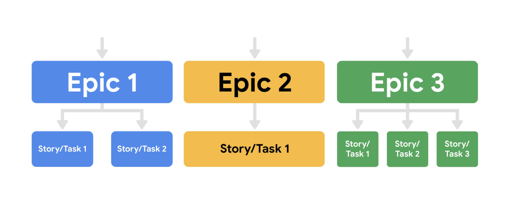

# Implementing Scrum

## Product Backlog: The Scrum Guide overview
An important Scrum artifact is: the Product Backlog. To recap, the Product Backlog is an ordered list of what needs to be done to improve a product. It is the single authoritative source for items the Scrum Team works on. During Product Backlog refinement, items are broken down and further defined by adding details. These details can vary, but often include such attributes as description, value, order, estimate, and size. The Product Goal is the long-term objective for the Scrum Team, and it is included in the Product Backlog. The rest of the Product Backlog defines what tasks will fulfill the Product Goal.

## The elements of user stories and epics
User stories are short, simple descriptions of a deliverable told from the perspective of the user. Creating user stories helps the team develop a solution that is always centered around the user’s needs and overall experience. Epics are a collection of user stories. Think of the concept of user stories in terms of books or films. A story is one single narrative, while an epic is a set of several related, independent stories. Each story tells a specific chronicle, while an epic gives a high-level view of the overall arc. 

### User stories
The driving factor behind every Scrum project is putting the customer first. User stories are a key component of ensuring that customers are satisfied with the product. A team writes a user story from the perspective of the user. Not only do user stories provide insight into what goals the user wants to achieve, but they enable collaboration, inspire creative solutions, and create momentum by giving the team a small win when the stories are developed. When writing user stories, you will need to include the following elements: 
- User persona. What is your user like? What is their relation to the project? What goals do they have? 
- Definition of Done. This refers to an agreed upon set of items that must be completed before a user story can be considered complete. 
- Tasks. What are the key activities needed to complete the user story?
- Any feedback already provided. If you are adding features to an existing product and you have already received feedback from customers on a past iteration, make sure to consider this feedback.  

### I.N.V.E.S.T. 
The user stories should meet the I.N.V.E.S.T. criteria: 
- Independent: The story’s completion is not dependent on another story.
- Negotiable: There is room for discussion about this item.
- Valuable: Completing the user story has to deliver value. 
- Estimable: The Definition of Done must be clear so that the team can give each user story an estimate. 
- Small: Each user story needs to be able to fit within a planned Sprint.
- Testable: A test can be conducted to check that it meets the criteria.

Let’s imagine you are working on a project for a local library. The library hopes to launch a website so that customers can read reviews before they check out books from the branch. The typical template for a user story looks like this: As a <user role>, I want this <action> so that I can get this <value>. Therefore, an example user story for this situation might read: As an avid reader, I want to be able to read reviews before I check out a book from my local branch so that I know I am getting a book I am interested in.

### Epics
An epic’s purpose is to help manage related user stories. In [this post](https://www.mountaingoatsoftware.com/blog/stories-epics-and-themes) , Mike Cohn, the inventor of the term “epic” as it relates to Scrum, describes epic as a “very large user story”—one that could not be delivered within a single iteration and may need to be split into smaller stories. The team should discuss together and reach a shared view of how to write and capture their user stories and epics. Keep in mind, epics are just larger user stories that are there to help organize the project.

### Key takeaway
Epics allow you to keep track of large, loosely-defined ideas, while user stories are a much smaller unit of work, inspired directly from the end user or customer. Both user stories and epics help teams ensure they are delivering value to the customer.

## The Sprint
Sprints are the heartbeat of Scrum, where ideas are turned into value. They are fixed length events of one month or less to create consistency. A new Sprint starts immediately after the conclusion of the previous Sprint. All the work necessary to achieve the Product Goal, including Sprint Planning, Daily Scrums, Sprint Review, and Sprint Retrospective, happen within Sprints. During the Sprint:
- No changes are made that would endanger the Sprint Goal;
- Quality does not decrease;
- The Product Backlog is refined as needed; and,
- Scope may be clarified and renegotiated with the Product Owner as more is learned.

Sprints enable predictability by ensuring inspection and adaptation of progress toward a Product Goal at least every calendar month. When a Sprint’s horizon is too long the Sprint Goal may become invalid, complexity may rise, and risk may increase. Shorter Sprints can be employed to generate more learning cycles and limit risk of cost and effort to a smaller time frame. Each Sprint may be considered a short project. Various practices exist to forecast progress, like burn-downs, burn-ups, or cumulative flows. While proven useful, these do not replace the importance of empiricism. In complex environments, what will happen is unknown. Only what has already happened may be used for forward-looking decision making. A Sprint could be cancelled if the Sprint Goal becomes obsolete. Only the Product Owner has the authority to cancel the Sprint.

## Sprint Retrospectives: Pitfalls and best practices
### Sprint Retrospectives
As a refresher, retrospectives are workshops or meetings that give project teams time to reflect on a project and brainstorm potential future improvements. In the Scrum framework, Sprint Retrospectives occur at the end of each Sprint, which is usually every one-to-four weeks. Sprint Retrospectives are a key practice that supports the Scrum theory and values. They are a critical moment to inspect and adapt to the outcomes produced within the Sprint timebox. Retrospectives occur much more often in Scrum than in traditional project management,  so it is important to consider some best practices and pitfalls to avoid to help make them engaging and productive for the entire team.

### Pitfalls
- **Avoid too many gimmicks**. There are many fun games and exercises that can be used by a Scrum Master when facilitating a Sprint Retrospective. However, not all teams enjoy this style. Consider using these exercises only occasionally or when the team asks for new ways of doing retrospectives.
- **Try not to only focus on the negative**. Not only is it necessary for the team to recognize what’s not working well, it is also important to highlight where they exceeded expectations. This ensures that the team both avoids failures and repeats successes as well.
- **Avoid changing processes after each retrospective**. It is okay to keep a new process in place for a few Sprints before deciding whether it was useful or not. You can always make note of opportunities for change, but try to wait a few Sprints before implementing new changes.

### Best practices
- **Ask open-ended, probing questions**. Ask questions that require thoughtful discussion rather than a yes-or-no answer. For example, ask, “How could we have better achieved our Sprint Goal?” rather than “Did we achieve the Sprint Goal?””
- **Consider diverse styles of communication and participation**. Make it easy for all team members to contribute their ideas and feedback. For example, not everyone feels comfortable speaking up in a large group. Try things like starting the retrospective with silent reflection by journaling or putting the team into pairs before starting a larger group conversation.
- Cover the many aspects of the Sprint when conducting a retrospective.
- The productivity and efficiency of the team
    - The scope and understanding of the definition of done
    - Communication and interactions within the team
    - Stakeholder communication
    - Progress towards more long-range release plans

- **Consider reflecting periodically on Scrum theory and values by asking specific questions**. For example, ask, “How could the team become more transparent?” or “How did we abide by our Scrum values in this Sprint?”
