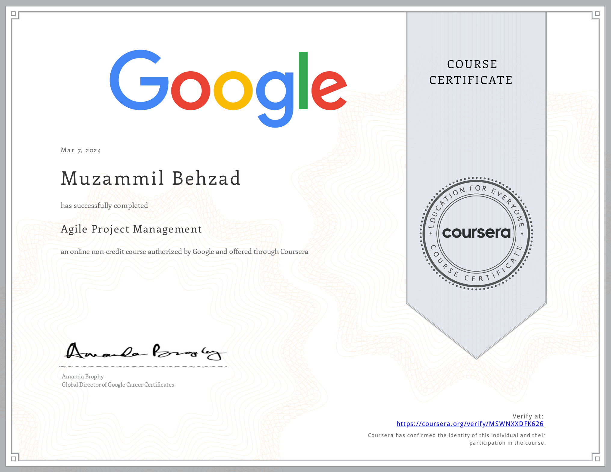

# Project Execution: Running the Project
The knowledge base contanis a specialization overview from the course [Project Execution: Running the Project](https://www.coursera.org/learn/project-execution-google?specialization=google-project-management) by Google on [Coursera](https://www.coursera.org/). It is divided into following modules:
- [The fundamentals of Agile](./The%20fundamentals%20of%20Agile.md)
- [Scrum 101](./Scrum%20101.md)
- [Implementing Scrum](./Implementing%20Scrum.md)
- [Applying Agile in the organization](./Applying%20Agile%20in%20the%20organization.md)

This is the fifth course in the Google Project Management Certificate program. This course will explore the history, approach, and philosophy of Agile project management, including the Scrum framework. You will learn how to differentiate and blend Agile and other project management approaches. As you progress through the course, you will learn more about Scrum, exploring its pillars and values and comparing essential Scrum team roles. You will discover how to build, manage, and refine a product backlog, implement Agile’s value-driven delivery strategies, and define a value roadmap. You will also learn strategies to effectively organize the five important Scrum events for a Scrum team, introduce an Agile or Scrum approach to an organization, and coach an Agile team. Finally, you will learn how to search for and land opportunities in Agile roles.

By the end of this course, you will be able to: 
 - Explain the Agile project management approach and philosophy, including values and principles.
 - Explain the pillars of Scrum and how they support Scrum values.
 - Identify and compare the essential roles in a Scrum team and what makes them effective.
 - Build and manage a Product Backlog and perform Backlog Refinement.
 - Describe the five important Scrum events and how to set up each event for a Scrum team.
 - Implement Agile’s value-driven delivery strategies and define a value roadmap.
 - Explain how to coach an Agile team and help them overcome challenges.
 - Conduct a job search for an Agile role and learn how to succeed in your interview.

[Here](https://www.coursera.org/account/accomplishments/verify/MSWNXXDFK626) is my certification for this first course.

## Certification Overview
###  Google Project Management Certification
**Project managers** are natural problem-solvers. They set the plan and guide teammates, and manage changes, risks, and stakeholders. This [Google Project Management: Professional Certificate](https://www.coursera.org/professional-certificates/google-project-management) includes over 140 hours of instruction and hundreds of practice-based assessments which will help you simulate real-world project management scenarios that are critical for success in the workplace. The content is highly interactive and exclusively developed by Google employees with decades of experience in program and project management.

**Skills you’ll gain will include**: Creating risk management plans; Understanding process improvement techniques; Managing escalations, team dynamics, and stakeholders; Creating budgets and navigating procurement; Utilizing  project management software, tools, and templates; Practicing Agile project management, with an emphasis on Scrum.

Through a mix of videos, assessments, and hands-on activities, you’ll get introduced to initiating, planning, and running both traditional and Agile projects. You’ll develop a toolbox to demonstrate your understanding of key project management elements, including managing a schedule, budget, and team.

### Certification Content

The [Google Project Management: Professional Certificate](https://www.coursera.org/professional-certificates/google-project-management) contains six courses.

- Foundations of Project Management
- Project Initiation: Starting a Successful Project
- Project Planning: Putting It All Together
- Project Execution: Running the Project
- **Agile Project Management**
- Capstone: Applying Project Management in the Real World

Most of the content is from the course itself. © Google and Coursera.