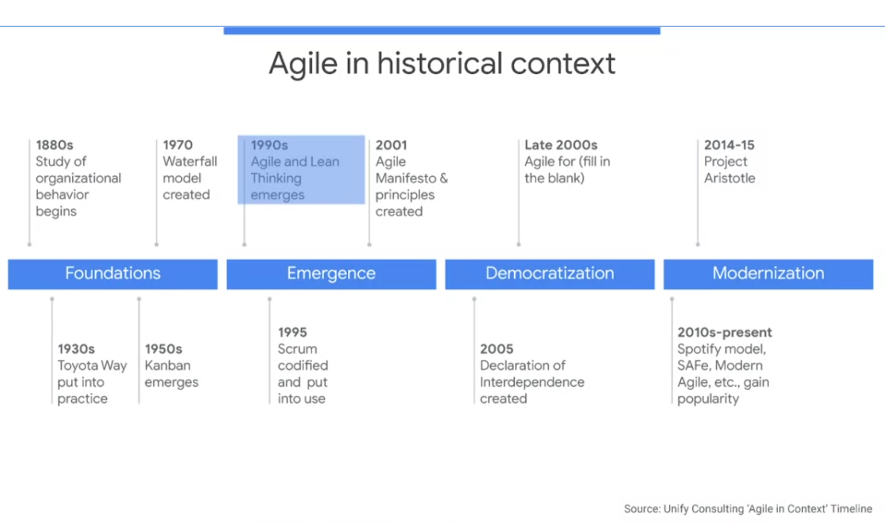
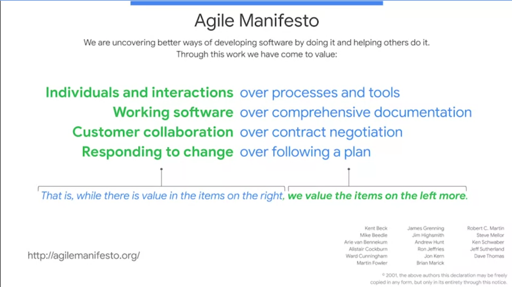
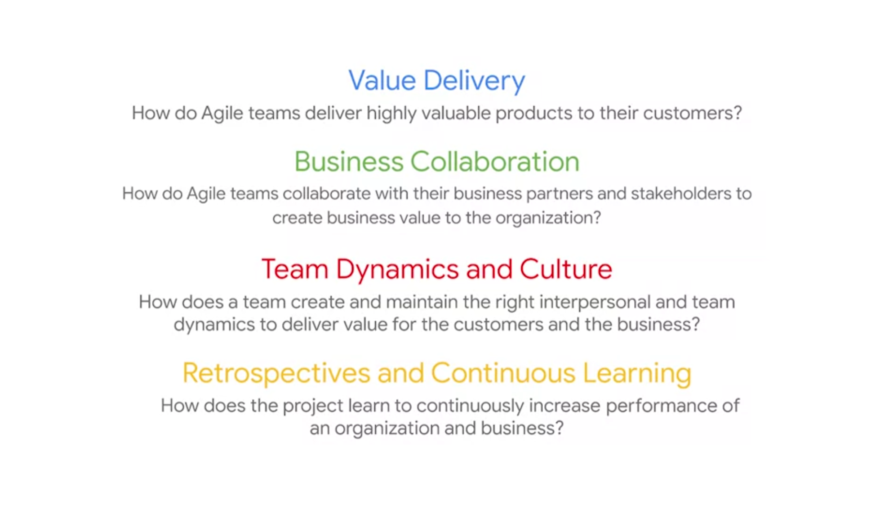
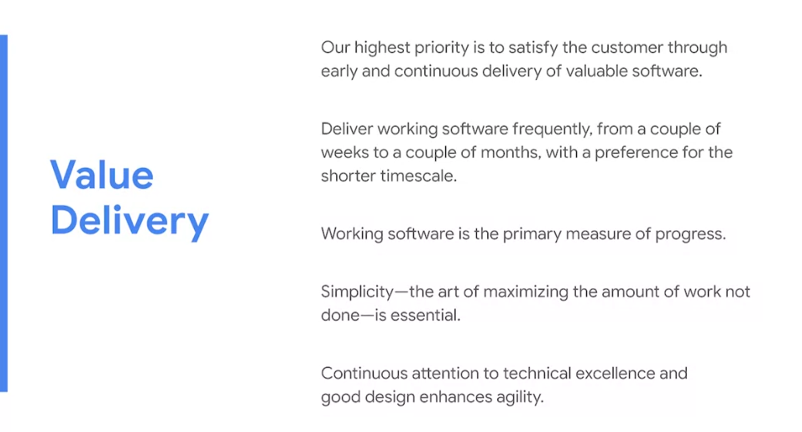
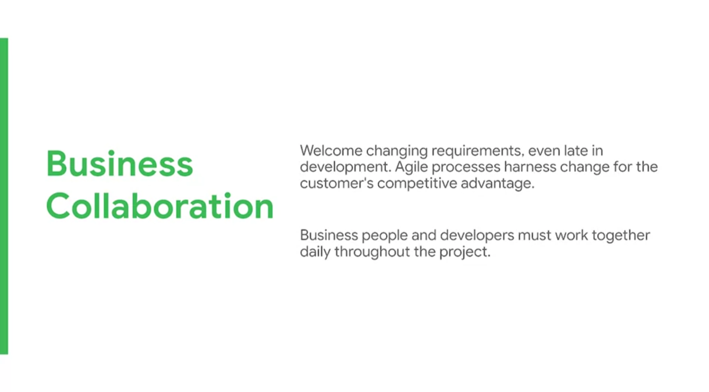
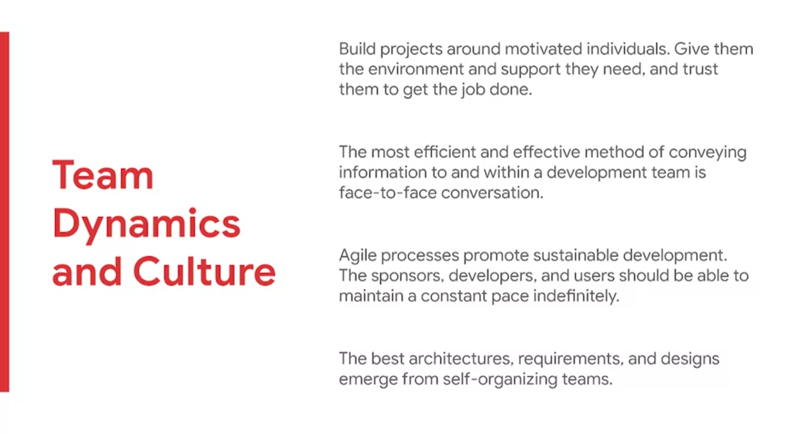
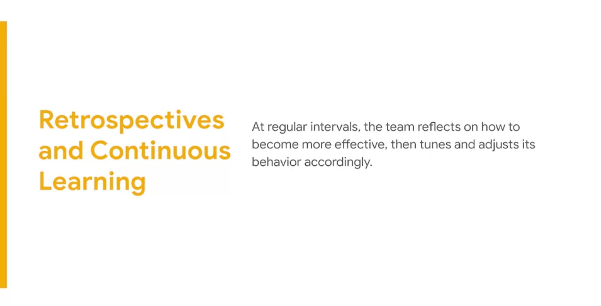
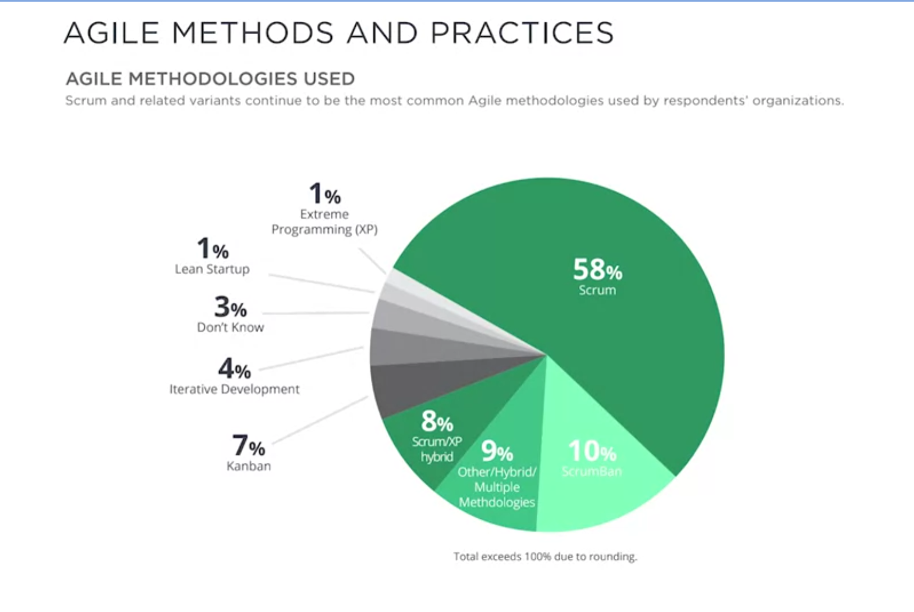
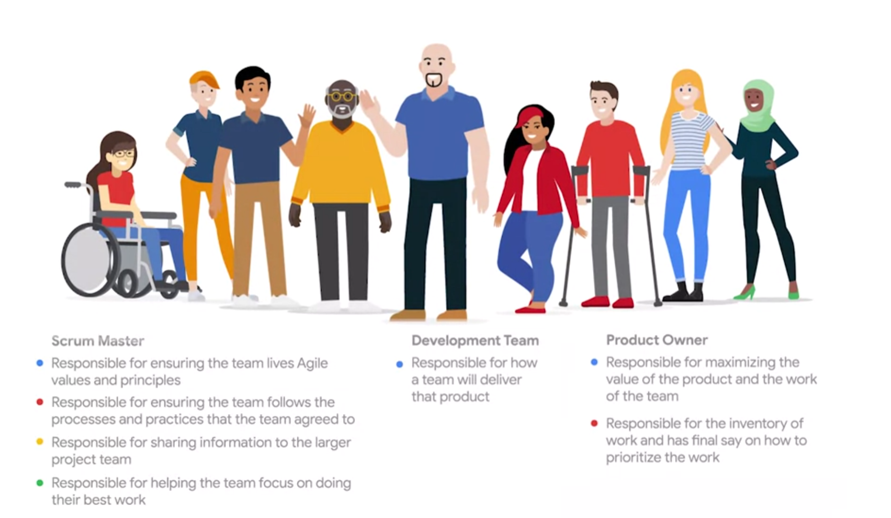
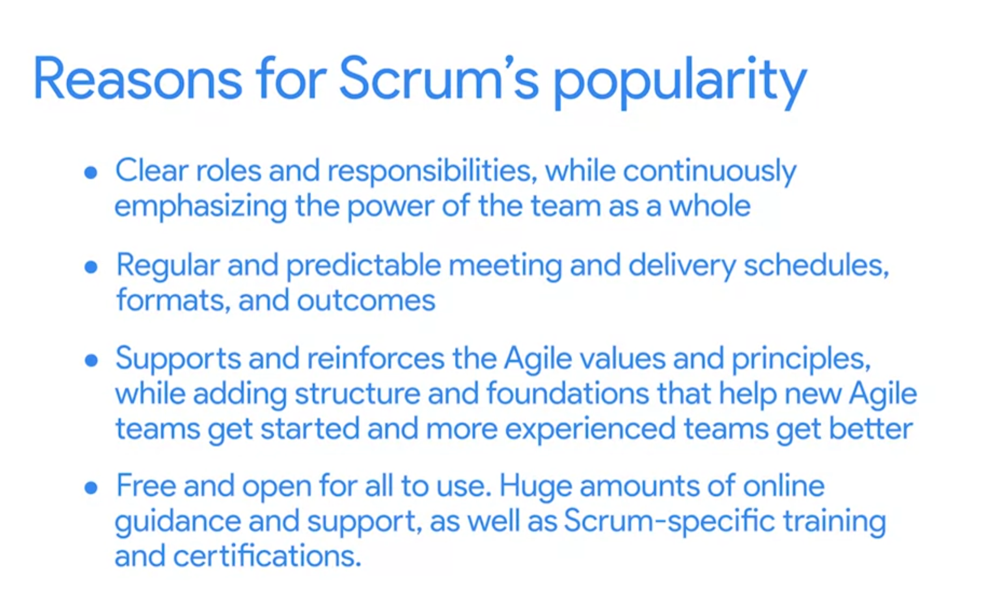

# The fundamentals of Agile

## Agile Manifesto
Agile values and principles inform the why, how, and what of Agile project management planning and processes.

## The founding principles of Scrum
Although Scrum was first used to describe Agile content in 1986 in the Harvard Business Review, the term originates from the internationally loved sport, rugby. In rugby, a “scrum” involves players huddling closely together with their heads down while trying to gain possession of the ball. Then, the players work together in order to achieve their shared goal: to get the ball across the line and score!

The original Harvard Business Review paper, written by Hirotaka Takeuchi and Ikujiro Nonaka and titled [The New New Product Development Game](https://hbr.org/1986/01/the-new-new-product-development-game), introduces Scrum in the chapter “Moving the Scrum downfield.” Throughout the paper, the authors continue to point out which characteristics of a team help to move the Scrum downfield. Those are: 

- **Built-in instability**: In the Scrum world, teams are given the freedom to achieve important outcomes with “challenging requirements.” Takeuchi and Nonaka explain that this gives teams “an element of tension” necessary to “carry out a project of strategic importance to the company.” 

- **Self-organizing teams**: Scrum Teams were intended to operate like their own start-up, with a unique order that lacks true hierarchy. These teams are considered self-organizing when they exhibit autonomy, continuous growth, and collaboration.  

- **Overlapping development phases**: Individuals on a Scrum Team must “work toward synchronizing their pace to meet deadlines.” At some point throughout the process, each individual’s pace starts to overlap with others, and eventually, a collective pace is formed within the team.

- **Multi-learning**: Scrum is a framework that relies heavily on trial and error. Scrum Team members also aim to stay up-to-date with changing market conditions and can then respond quickly to those conditions. 

- **Subtle control**: As we mentioned, Scrum Teams are self-organizing and operate like a start-up, but that doesn’t mean there is no structure at all. By creating checkpoints throughout the project to analyze team interactions and progress, Scrum Teams maintain control without hindering creativity. 

- **Organizational transfer of learning**: On Scrum Teams, everyone is encouraged to learn skills that may be new to them as they support other team members. 

The authors’ main point was that “each element, by itself, does not bring about speed and flexibility. But taken as a whole, the characteristics can produce a powerful new set of dynamics that will make a difference.” Though these concepts were first introduced in 1986, they still remain remarkably true for Scrum Teams today. 

## Key takeaways 
- You must always be able to adapt based on your team’s preferences and goals. The Spotify team started in Squads, but as they scaled, they added new types of groups within the organization—without disrupting the existing Squads. They continued to do so until they found the perfect balance of collaboration and ownership. 

- Always examine the needs of your project and organization. What works for Spotify may not be an exact fit for your team. If you are on a team that needs scaling, be inspired by this model, but use the aspects that work best for your organization. 

- Don’t be afraid of trial and error. If you try something and it doesn’t feel quite right, you can easily adjust.

- You should never consider yourself done improving. There are always changes that can be made for the better. 

